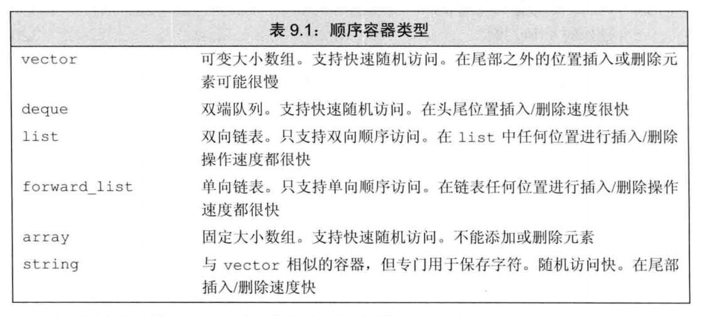

## 第9章 顺序容器

### 顺序容器综述

* 标准库容器是模板类型，用来保存给定类型的对象
* 在顺序容器中，元素是按顺序存放的，顺序容器有公共的标准接口
* string和vector将元素保存在连续的内存空间中，由于元素是连续存储的，因此通过下标访问很快，但是在容器中间添加或删除元素是很费时的
* list和forward_list令容器中添加任何元素很高效，但是不支持元素的随机访问，访问一个元素需要遍历整个容器
* array和forward_list都是C++11新添加的结构，array对应内置数组，forward_list对应单向链表
* 除非有更好的理由，否则首选vector

### vector对象如何动态增长
* 由于vector是连续存储的空间，因此在创建时实际会为它分配更大的空间，reserve(n)就用于分配至少包含n个元素的内存空间，capacity函数可以得知不重新分配内存空间，vector能保存多少元素

### 容器适配器
* 标准库定义了3个顺序容器适配器（adaptor）：stack, queue, priority_queue
* adaptor是一个通用的概念，能使某种事物的行为看起来像另一种事物一样，stack接受一个顺序容器（不是array，也不是forward_list），并使其操作起来像stack一样
